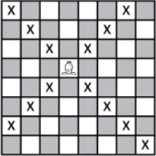
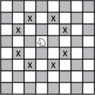
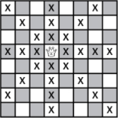
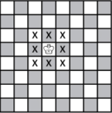

# Bishop User Story

>User Story **Bishop**
As a bishop, I want to move following the chess rules, so that chess rules are respected.

Move rule: A bishop can move diagonnaly.

Board bounds rule: A bishop can't go behind board limits.

# Knight User Story

>User Story **Knight**
As a knight, I want to move following the chess rules, so that chess rules are respected.

Move rule: A knight moves two box in a direction, and one box in the orthogonal direction.

Board bounds rule: A knight can't go behind board limits.

# Queen User Story

>User Story **Queen**
As a queen, I want to move following the chess rules, so that chess rules are respected.

Move rule: A queen can move vertically, horizontally and diagonally.

Board bounds rule: A queen can't go behind board limits.

# Queen User Story

>User Story **King**
As a King, I want to move following the chess rules, so that chess rules are respected.

Move rule: A king can move one box anywhere around him.

Board bounds rule: A king can't go behind board limits.