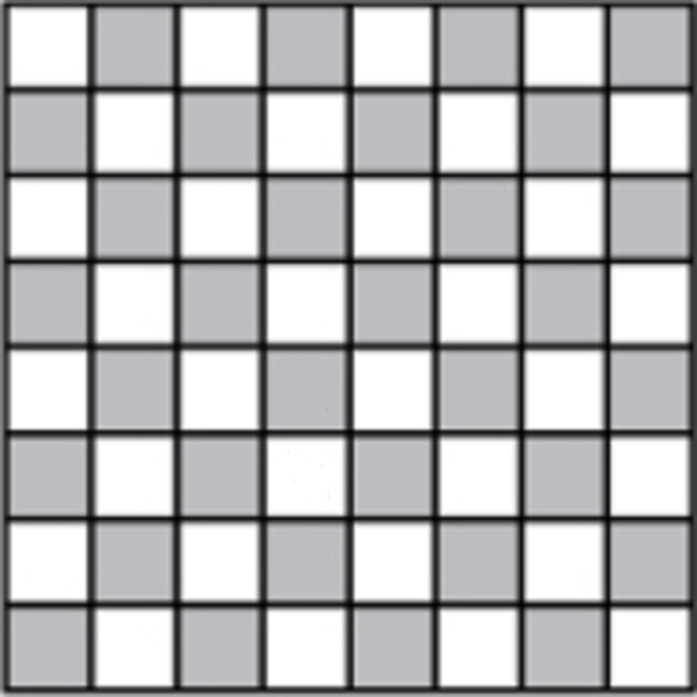
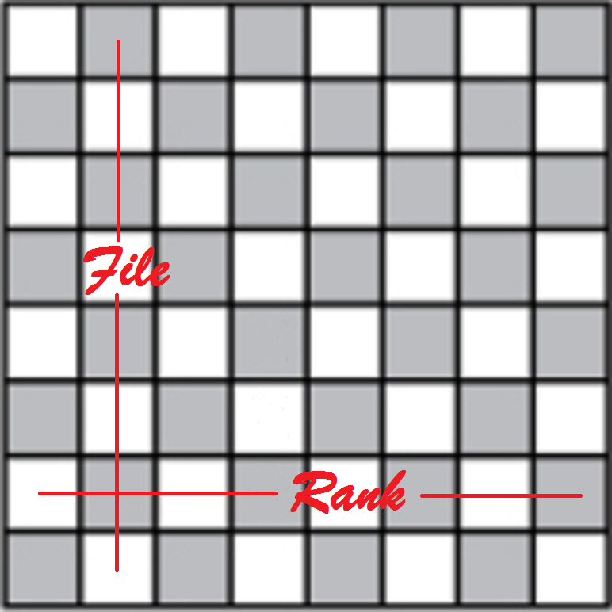
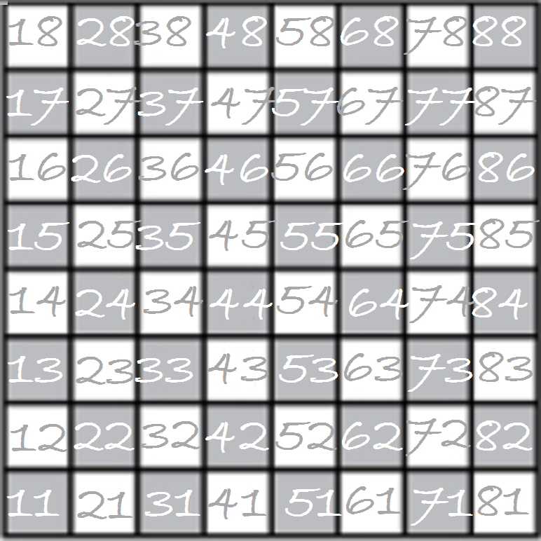
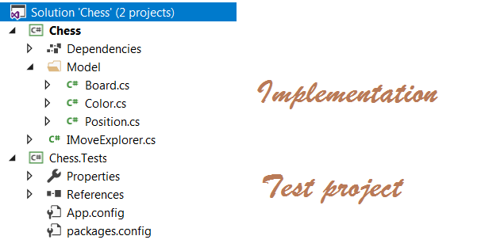
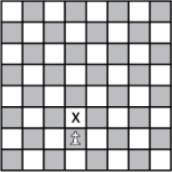

 
# Board explanation
The board is defined as a 8x8 boxes.

Vertical indexing is called **File**, while horizontal indexing is called **Rank**.

Combining **File** and **Rank** gives a **Position** on the chessboard.


# Writing your first behavior

## Exploring solution architecture

Our starting point will be this solution:

It contains 2 projects:
-**Chess**: the implementation project
-**Chess.Tests**: the test project

All needed libraries are already referenced. You should not use another one.

## User Story: 

A user story follow a simple template like:
**As a** ```type of user```, **I want** ```some goal```, **so that** ```some reason```.

It also contains **business rules**.

From one **business rules**, we can deduce one or more **functionnal examples**. They are finally translated into **Scenarios**. Generally, a **User Story** is mapped to a **Feature**.

Let's start with a first User Story.

>User Story **Pawn**
As a pawn, I want to move following the chess rules, so that chess rules are respected.
One step forward rule: A white pawn can move one step forward, in the vertical direction.


## Goal
Now that you have a Business rule, you have to transform it into real code!
>**Tip**: start by adding a new SpecFlow feature file.