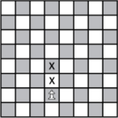
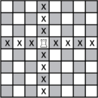

# Adding more pawn behavior

Let's add some new behavior to the previous User Story.

>User Story **Pawn**
As a pawn, I want to move following the chess rules, so that chess rules are respected.

One step forward rule: A white pawn can move one step forward, in the vertical direction.

Two stpes forward rule: A pawn can move two steps forward in the vertical direction, if its rank is the initial rank. For white pawns, initial rank is 2, for black pawn, initial rank is 7.

Can't go backward rule: A pawn can't go backward.

Board bounds rule: A pawn can't go behind board limits.

> Tip: write a second scenario, check its validity, then refactor your code to reuse duplicated code.

# Rook User Story

>User Story **Rook**
As a rook, I want to move following the chess rules, so that chess rules are respected.

Move rule: A rook can move vertically and horizontally anywhere on the board.

Board bounds rule: A rook can't go behind board limits.

> Tip: Try to reuse steps between scenarios **and** features.